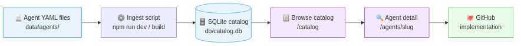
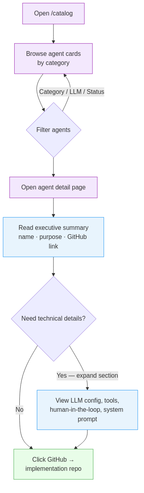

# AIC Agent Library v. 0.1

A browse-and-discovery catalog for the AI agents produced for the AI Champion (AIC) consortium. It is one of the main WP5 outputs. This repository does not contain the agents themselves, but the code for the website presenting and showcasing them. With the catalog, tech evaluators and engineers can find the right agent for their use case. One can filter by discipline, read an executive summary, expand technical details when needed, and follow a link straight to the GitHub implementation.

---

## What it does

The AIC consortium produces AI agents that automate workflows across engineering, operations, and project management. This library is the front door to that catalog — a fast, searchable index where you can:

- **Browse** agents by category, LLM, and maturity status
- **Read** a plain-language summary of what each agent does and when to use it
- **Inspect** the technical specification (LLM config, tools, human-in-the-loop requirements) when you need the details
- **See** which fields are tailorable for your environment before you open the GitHub repo

The platform is a discovery tool, not a runtime. Agents live in GitHub; this library helps you find the right one.

---

## How it works

Each agent is described in a YAML file using the Oracle AgentSpec format. On startup, the platform ingests those files into a local catalog database and serves a SvelteKit web app.



---

## Getting started

**Prerequisites:** Node.js 20+

```bash
# 1. Clone and install
git clone https://github.com/aic-consortium/aic-agent-library
cd aic-agent-library
npm install

# 2. Start the development server
#    (runs db schema push, ingests agent files, starts the web app)
npm run dev
```

Open [http://localhost:5173](http://localhost:5173) — you land on the catalog automatically.

For a production build:

```bash
npm run build
npm run preview
```

---

## Adding agents

Drop a YAML file into `data/agents/` and restart the server. The ingest step runs automatically on `npm run dev` and `npm run build`.

A minimal agent file looks like this:

```yaml
component_type: Agent
id: "your-org-agent-001"
name: "Your Agent Name"
description: "One sentence describing what this agent does."
metadata:
  category: "mechanical"        # discipline or domain
  maturity: "experimental"      # experimental | beta | production
  tags:
    - "your-tag"
system_prompt: "You are a ..."
llm_config:
  name: "claude-sonnet-4-6"
  default_generation_parameters:
    max_tokens: 2048
    temperature: 0.2
tools:
  - name: "tool_name"
    description: "What this tool does"
human_in_the_loop: false
```

Re-running ingest on an existing agent ID updates the record — it never creates duplicates.

---

## Using the catalog



**Catalog page** (`/catalog`)
- Cards display each agent's name, summary, category, maturity badge, and tags
- Three filter dropdowns — **Category**, **Model**, and **Status** — narrow the list instantly without a page reload
- Pagination handles large catalogs without layout degradation

**Detail page** (`/agents/<slug>`)
- The executive summary (name, purpose, GitHub link) is visible by default
- Click **Technical Specification** to expand LLM config, tools, and system prompt details
- The **Customization Options** panel lists which fields of the agent are tailorable for your environment

---

## What's coming

| Phase | What it adds |
|-------|-------------|
| Search | Natural language + keyword search, results update as you type |
| Customization | "Customize" entry point with wizard flows for well-defined configuration patterns |

---

## Deploying with Podman

The repo includes a `Containerfile`, `.containerignore`, and `podman-compose.yml`
for running the built server in a container.

```bash
# Build the image (multi-stage: installs deps, runs the full build
# pipeline — schema push, YAML ingest, vite build — then copies the
# result into a slim runtime image)
podman build -t aic-agent-library -f Containerfile .

# Run it
podman run -d --name aic-agent-library -p 3000:3000 aic-agent-library

# Or with podman-compose
podman-compose up -d --build
```

Open [http://localhost:3000](http://localhost:3000).

The catalog data is baked into the image at build time from `data/agents/`.
To pick up new or changed agent YAML files, rebuild the image.

Env vars the container respects: `PORT` (default `3000`), `CATALOG_DB_PATH`.

The runtime image only ships production dependencies (`npm prune --omit=dev`
after the build) — build-only tooling like `vite`'s CLI, `drizzle-kit`, and
`tsx` never reaches the running container.

---

## Technical documentation

For stack choices, data model, ingestion pipeline, component structure, and contribution guidelines, see [TECHNICAL_DOCUMENTATION.md](TECHNICAL_DOCUMENTATION.md).

---

*Part of the AI Champion (AIC) consortium project.*
