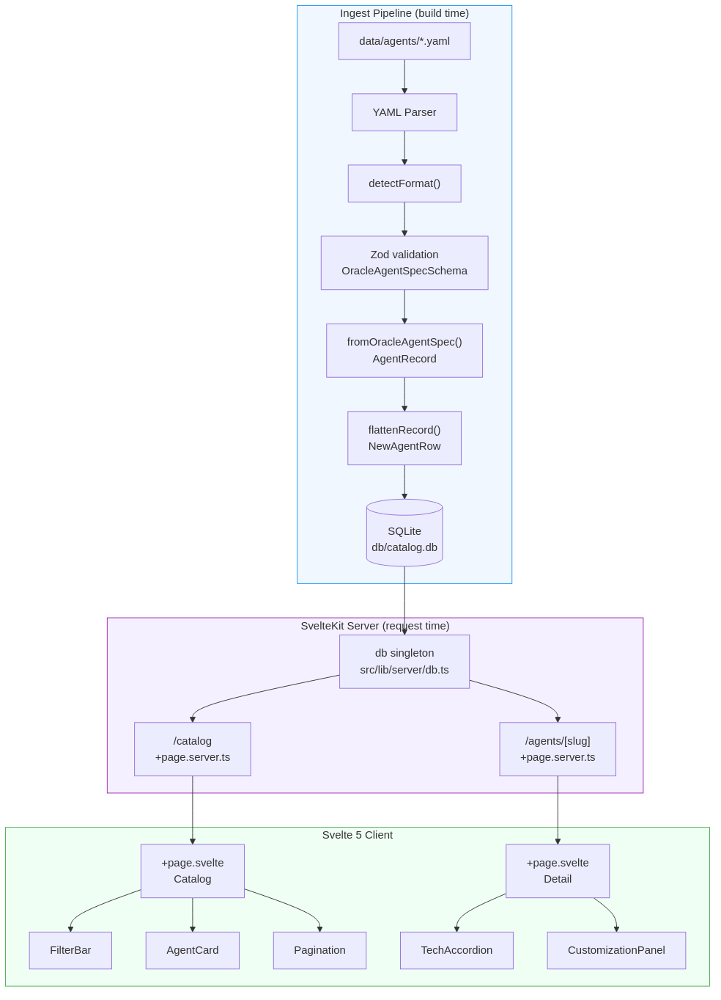
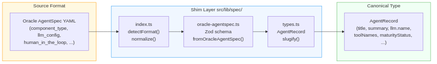

# Technical Documentation — AIC Agent Library

> For a non-technical overview and getting-started guide, see [README.md](README.md).

---

## Contents

1. [Tech Stack](#tech-stack)
2. [Project Structure](#project-structure)
3. [Architecture Overview](#architecture-overview)
4. [Data Model](#data-model)
5. [Spec Shim Layer](#spec-shim-layer)
6. [Ingestion Pipeline](#ingestion-pipeline)
7. [Database](#database)
8. [SvelteKit Routes](#sveltekit-routes)
9. [Components](#components)
10. [Tests](#tests)
11. [Build Pipeline](#build-pipeline)
12. [Configuration Files](#configuration-files)
13. [Adding a New Agent Spec Format](#adding-a-new-agent-spec-format)

---

## Tech Stack

| Layer | Technology | Version |
|-------|-----------|---------|
| Frontend framework | SvelteKit 2 + Svelte 5 | `^2.55.0` / `^5.54.0` |
| CSS | Tailwind CSS v4 (Vite plugin) | `^4.2.2` |
| Build tool | Vite | `^8.0.1` |
| ORM | Drizzle ORM | `^0.45.1` |
| Database | SQLite via better-sqlite3 | `^12.8.0` |
| Schema validation | Zod 4 | `^4.3.6` |
| YAML parsing | yaml | `^2.8.2` |
| Script runner | tsx | `^4.21.0` |
| Test framework | Vitest | `^4.1.0` |
| Component testing | @testing-library/svelte | `^5.3.1` |
| Production adapter | @sveltejs/adapter-node | `^5.5.4` |
| Language | TypeScript 5 (strict) | `^5.9.3` |

**Node.js requirement:** 20+

---

## Project Structure

```
├── src/
│   ├── app.css                          # Global Tailwind import
│   ├── lib/
│   │   ├── components/                  # Reusable Svelte components
│   │   │   ├── AgentCard.svelte
│   │   │   ├── FilterBar.svelte
│   │   │   ├── Pagination.svelte
│   │   │   ├── TechAccordion.svelte
│   │   │   └── CustomizationPanel.svelte
│   │   ├── config/
│   │   │   └── tailorable-fields.ts     # Fields users can customize per-agent
│   │   ├── server/
│   │   │   └── db.ts                    # Database singleton (server-only)
│   │   └── spec/                        # Spec shim: format detection & normalization
│   │       ├── types.ts                 # AgentRecord type + slugify()
│   │       ├── oracle-agentspec.ts      # Zod schema + Oracle AgentSpec adapter
│   │       └── index.ts                 # detectFormat() + normalize() entry point
│   └── routes/
│       ├── +layout.svelte               # Root layout (header + wrapper)
│       ├── +page.server.ts              # Redirect / → /catalog
│       ├── catalog/
│       │   ├── +page.server.ts          # Load: paginated agent list + filter options
│       │   └── +page.svelte             # Catalog UI: grid, filters, pagination
│       └── agents/[slug]/
│           ├── +page.server.ts          # Load: single agent by slug, 404 on miss
│           └── +page.svelte             # Detail UI: summary + accordion + panel
├── scripts/
│   ├── ingest.ts                        # Ingestion pipeline (CLI)
│   └── ingest.test.ts
├── drizzle/
│   └── schema.ts                        # SQLite table definition
├── data/
│   └── agents/                          # Agent YAML source files
│       └── fixtures/                    # Test fixtures (not ingested in prod)
├── db/
│   └── catalog.db                       # SQLite database (generated at build time)
├── docs/
│   ├── *.mmd                            # Mermaid diagram sources
│   └── images/                          # Generated diagram PNGs
├── drizzle.config.ts
├── vite.config.ts
├── svelte.config.js
├── tsconfig.json
└── vitest.config.ts
```

---

## Architecture Overview

The platform has three distinct stages: **ingest** (build time), **serve** (request time), and **render** (client).



- **Ingest** runs once at build time (or dev server start). It reads YAML files, validates them, converts to the internal `AgentRecord` type, and writes to SQLite.
- **Serve** runs per request. SvelteKit load functions query SQLite via Drizzle ORM and pass typed data to components.
- **Render** runs in the browser. Svelte 5 components handle display and client-side filter state. No API calls are made after the initial page load.

---

## Data Model

### AgentRecord (internal canonical type)

Defined in `src/lib/spec/types.ts`. All UI code works against this type — never against Oracle AgentSpec directly.

```typescript
interface AgentLlm {
  name: string
  temperature: number | null
  maxTokens: number | null
  topP: number | null
}

interface AgentRecord {
  slug: string                  // Primary key, URL-safe (derived from name)
  title: string                 // Human-readable agent name
  specId: string | null         // Original AgentSpec id field, if present
  summary: string               // Plain-language description
  systemPrompt: string
  llm: AgentLlm
  toolNames: string[]
  requiresHumanApproval: boolean
  category: string | null
  githubUrl: string | null
  maturityStatus: 'production' | 'beta' | 'experimental'
  tags: string[]
  lastIngestedAt: string        // ISO-8601
}
```

### SQLite Schema (`drizzle/schema.ts`)

Table: `agents`

| Column | Type | Notes |
|--------|------|-------|
| `slug` | TEXT PRIMARY KEY | URL-safe identifier |
| `title` | TEXT NOT NULL | |
| `summary` | TEXT NOT NULL | |
| `system_prompt` | TEXT NOT NULL | |
| `llm_name` | TEXT NOT NULL | |
| `llm_temperature` | REAL | nullable |
| `llm_max_tokens` | INTEGER | nullable |
| `llm_top_p` | REAL | nullable |
| `tool_names` | TEXT NOT NULL | JSON-serialized `string[]` |
| `requires_human_approval` | INTEGER NOT NULL | Boolean (0/1) |
| `category` | TEXT | nullable |
| `github_url` | TEXT | nullable |
| `maturity_status` | TEXT NOT NULL | `experimental` \| `beta` \| `production` |
| `tags` | TEXT NOT NULL | JSON-serialized `string[]` |
| `spec_id` | TEXT | nullable |
| `last_ingested_at` | TEXT NOT NULL | ISO-8601, default `strftime(...)` |

`toolNames` and `tags` are stored as JSON strings and deserialized in load functions before being passed to components.

---

## Spec Shim Layer

The shim layer decouples the rest of the codebase from Oracle AgentSpec's field names. If the consortium adopts a different spec language, only the shim needs to change.



### Files

**`src/lib/spec/types.ts`**
Defines `AgentRecord` and `AgentLlm`. Also exports `slugify(name)` — lowercases, replaces non-alphanumeric characters with hyphens, collapses consecutive hyphens.

**`src/lib/spec/oracle-agentspec.ts`**
- `OracleAgentSpecSchema` — Zod 4 schema that validates raw YAML/JSON against the Oracle AgentSpec structure
- `fromOracleAgentSpec(raw)` — adapter function that maps Oracle AgentSpec fields to `AgentRecord`

> **Design constraint:** Oracle AgentSpec field names (`llm_config`, `human_in_the_loop`, `component_type`, etc.) appear **only** in this file. All other code uses `AgentRecord` field names.

**`src/lib/spec/index.ts`**
- `detectFormat(raw)` — inspects the raw object for `component_type === 'Agent'`; throws if unrecognized
- `normalize(formatId, raw)` — validates with Zod, calls the appropriate adapter, returns `AgentRecord`

### Adding support for a new spec format

1. Create `src/lib/spec/my-format.ts` with a Zod schema and adapter function
2. Add the format ID to the `FormatId` union in `index.ts`
3. Add a `detectFormat` branch and `normalize` case
4. Add YAML fixtures and tests

---

## Ingestion Pipeline

**Entry point:** `scripts/ingest.ts`
**Triggered by:** `npm run ingest` (runs as part of `npm run dev` and `npm run build`)

### Flow

```
data/agents/*.yaml
  → YAML.parse()
  → detectFormat()         # identify spec type
  → normalize()            # Zod validate + adapter → AgentRecord
  → flattenRecord()        # AgentRecord → NewAgentRow (serialize arrays to JSON)
  → db.insert().onConflictDoUpdate()   # upsert by slug
```

- Files that fail validation are skipped with a `[SKIP]` log — they don't abort the pipeline
- Ingestion is **idempotent**: re-running the same files updates `last_ingested_at` but does not create duplicates
- Data directory and DB path are overrideable via environment variables:
  - `INGEST_DATA_DIR` (default: `./data/agents`)
  - `INGEST_DB_PATH` (default: `./db/catalog.db`)

---

## Database

`src/lib/server/db.ts` exports a singleton Drizzle ORM instance and the `agents` table reference.

```typescript
const DB_PATH = process.env.CATALOG_DB_PATH ?? './db/catalog.db'
const sqlite = new Database(DB_PATH)
sqlite.pragma('journal_mode = WAL')      // Write-Ahead Log: concurrent reads
export const db = drizzle(sqlite)
export { agents }
```

- **WAL mode** allows multiple concurrent reads alongside a single writer, suitable for a web app serving catalog queries
- The file lives in `src/lib/server/` — SvelteKit enforces that nothing outside load functions or server routes can import from this path
- Override the DB path with `CATALOG_DB_PATH` for staging/testing environments

---

## SvelteKit Routes

### `GET /` → redirect to `/catalog`
`src/routes/+page.server.ts` — immediate 302 redirect.

### `GET /catalog`
`src/routes/catalog/+page.server.ts`

Load function accepts URL search params: `page`, `category`, `llm`, `maturity`.

- Pagination: 24 agents per page, offset calculated from `page`
- Filters applied as Drizzle `eq()` / `and()` conditions
- Returns: agent list, total count, current page, total pages, distinct filter options (categories, LLMs, maturity statuses), active filter values
- `toolNames` and `tags` JSON strings are deserialized before return

`src/routes/catalog/+page.svelte`

- Filter state held as Svelte 5 runes (`$state`)
- `$derived.by` computes the filtered view client-side (no roundtrip on filter change)
- Filter changes update URL params via `goto()` with `replaceState: true` (no browser history entry)

### `GET /agents/[slug]`
`src/routes/agents/[slug]/+page.server.ts`

- Queries single agent by slug
- Returns `error(404)` for unknown slugs
- Deserializes JSON fields before return

`src/routes/agents/[slug]/+page.svelte`

- Two-column desktop layout: `lg:grid-cols-[2fr_1fr]`
- Left column: executive summary, tags, GitHub link, TechAccordion
- Right column: CustomizationPanel (sticky)

---

## Components

### AgentCard
**Props:** `{ slug, title, summary, category, maturityStatus, tags }`
Renders a card link to the agent detail page. Maturity badge is color-coded. Shows first 3 tags. Hover and focus ring states.

### FilterBar
**Props:** filter options arrays + selected value strings + change/clear callbacks
Three `<select>` dropdowns (Category, Model, Status). "Clear filters" button appears only when at least one filter is active.

### Pagination
**Props:** `{ currentPage, totalPages }`
Previous/Next buttons. Preserves existing URL params when navigating pages. Buttons disabled at boundaries.

### TechAccordion
**Props:** LLM config fields + tools + requiresHumanApproval + systemPrompt
Native `<details>`/`<summary>` element — collapsed by default (no `open` attribute). No JavaScript required for expand/collapse.

### CustomizationPanel
No props — imports `TAILORABLE_FIELDS` directly from config.
Renders a static list of 4 tailorable fields with labels, descriptions, and "Customizable" badges. Placeholder for Phase 4 wizard flows.

---

## Tests

### Test environment

- **Component tests** (`src/lib/components/*.test.ts`): `jsdom` environment (DOM rendering)
- **All other tests**: Node.js environment

### Coverage

| File | What it tests |
|------|---------------|
| `src/lib/spec/types.test.ts` | `slugify()`, field name isolation (AgentRecord never leaks AgentSpec names) |
| `src/lib/spec/oracle-agentspec.test.ts` | Zod schema validation, `fromOracleAgentSpec()`, minimal + malformed inputs |
| `src/lib/components/FilterBar.test.ts` | Dropdowns render, callbacks fire, clear button visibility |
| `src/lib/components/TechAccordion.test.ts` | `<details>` closed by default, content display |
| `src/lib/components/CustomizationPanel.test.ts` | Heading, 4 fields rendered, badge count |
| `src/routes/catalog/catalog.test.ts` | Pagination offset, 3-attribute filtering, distinct values, JSON deserialization |
| `src/routes/agents/detail.test.ts` | Single agent query, 404 on unknown slug, JSON deserialization |
| `scripts/ingest.test.ts` | Fixture ingestion, idempotency, skip on malformed, `last_ingested_at` updates |

Run tests:
```bash
npm test                  # run once
npm test -- --watch       # watch mode
```

---

## Build Pipeline

```bash
# Development
npm run dev
#  1. drizzle-kit push   — apply any schema changes to db/catalog.db
#  2. tsx scripts/ingest.ts — ingest data/agents/*.yaml into SQLite
#  3. vite dev           — start dev server on :5173 with HMR

# Production
npm run build
#  1. drizzle-kit push
#  2. tsx scripts/ingest.ts
#  3. vite build         — bundle to build/ (client + Node.js server)

npm run preview           # serve the production build locally
```

The built output in `build/` is a Node.js server (adapter-node). Run it with:
```bash
node build
```

Environment variables for production:
- `CATALOG_DB_PATH` — path to the SQLite database file
- `INGEST_DATA_DIR` — path to the agent YAML directory
- `PORT` — HTTP port (default: 3000)

---

## Configuration Files

### `drizzle.config.ts`
Points Drizzle Kit at `drizzle/schema.ts` and `db/catalog.db`. Used by `npm run db:push` to apply schema changes.

### `svelte.config.js`
- Preprocessor: `vitePreprocess()` (Svelte 5 + TypeScript support)
- Adapter: `adapter-node` (Node.js production server)
- Alias: `$lib` → `src/lib`

### `vite.config.ts`
Two plugins: `@tailwindcss/vite` (Tailwind v4 JIT) and `sveltekit()`.

### `tsconfig.json`
Extends `.svelte-kit/tsconfig.json`. Strict mode enabled. Includes `src/`, `scripts/`, `drizzle/`.

### `vitest.config.ts`
Configures `sveltekit()` and `svelteTesting()` plugins. Routes component test files to jsdom, everything else to Node.

---

## Adding a New Agent Spec Format

1. **Add a Zod schema and adapter** in `src/lib/spec/<format-name>.ts`:
   ```typescript
   export const MyFormatSchema = z.object({ ... })
   export function fromMyFormat(raw: MyFormat): AgentRecord { ... }
   ```

2. **Register it** in `src/lib/spec/index.ts`:
   ```typescript
   // In detectFormat():
   if (raw.some_identifying_field) return 'my-format'

   // In normalize():
   case 'my-format':
     return fromMyFormat(MyFormatSchema.parse(raw))
   ```

3. **Add test fixtures** to `data/agents/fixtures/` and test cases to `src/lib/spec/<format-name>.test.ts`.

No other files need to change.

---

*Last updated: 2026-03-19*
